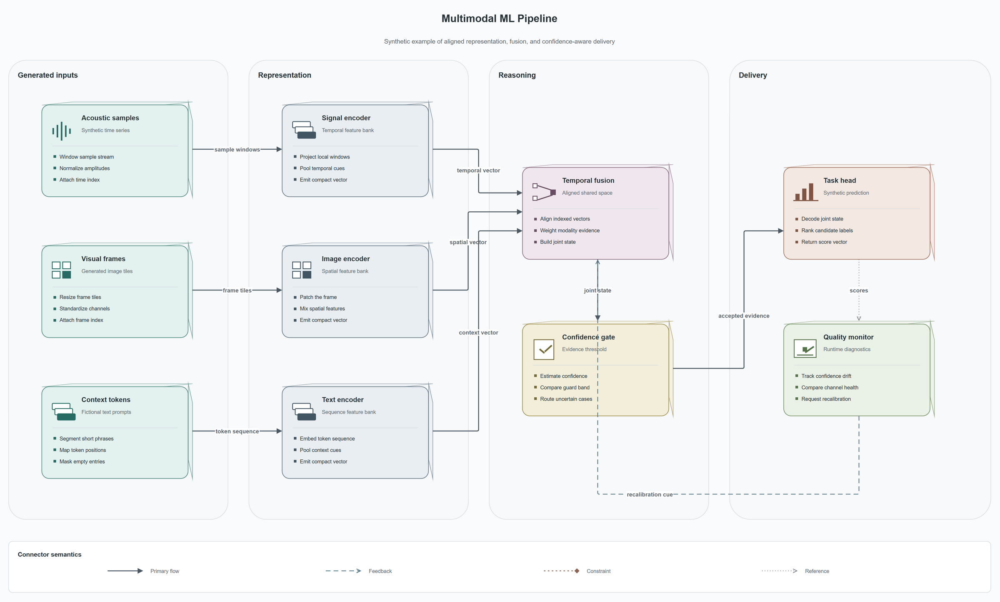
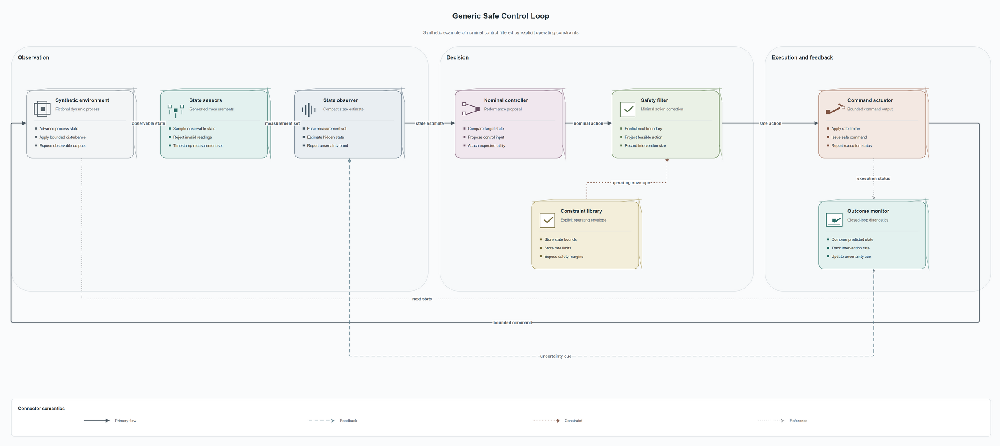

# Draw.io Academic Architecture

[](https://github.com/nickyeung575/drawio-academic-architecture/actions/workflows/ci.yml)

A reusable Codex Skill for turning architecture briefs into restrained, editable 3D draw.io figures with meaningful vector motifs, explicit module mechanisms, structural validation, visual QA, and publication privacy gates.

中文简介：这是一个面向科研架构图和系统流程图的 Codex Skill。它强调克制配色、浅 3D 层次、模块内部机制、可编辑 draw.io 源文件，以及发布前的隐私检查。

## Synthetic examples

These examples were created specifically for this repository. They do not reproduce or derive from a private paper figure.

### Multimodal ML Pipeline



Parallel generated inputs, modality encoders, evidence fusion, confidence gating, and monitored delivery.

### Generic Safe Control Loop



A textbook-style closed loop with state estimation, a nominal proposal, explicit constraints, a safety filter, execution, and feedback.

Each directory contains `spec.json`, editable uncompressed `diagram.drawio`, `preview.png`, `preview.svg`, and `review.json`.

## What the Skill adds

- Copy-first revision of existing diagrams with stable cell-ID inspection.
- A portable JSON architecture contract and validator.
- Restrained semantic color tokens and one consistent shallow-depth system.
- One editable motif and one-to-three concrete mechanism lines per module.
- Clear separation between live canvas tools and saved-file validation/export tools.
- 2000-pixel preview inspection plus structural and privacy checks.
- Clean-room rules for synthetic public examples.

## Prerequisite

Install [drawio-scientific-illustrator](https://github.com/icebird1998/drawio-scientific-illustrator) separately. This release is verified against upstream `v1.0.0` at commit `dd248168295bbcac34c9d74a8bd9efac3c2fbf99` and expects both `drawio-live` and `drawio-file-utils` MCP servers.

The upstream project is an external MIT-licensed dependency and is not bundled here. See [NOTICE](NOTICE).

## Install

```powershell
git clone https://github.com/nickyeung575/drawio-academic-architecture.git
cd drawio-academic-architecture
powershell -ExecutionPolicy Bypass -File scripts/install.ps1
```

Restart Codex after installation so the new Skill metadata is loaded.

## Example prompts

```text
Use $drawio-academic-architecture to turn this generic system brief into an editable, restrained 3D draw.io figure.
```

```text
Use $drawio-academic-architecture to revise this .drawio copy. Preserve stable IDs, enrich each module with concrete mechanisms, validate it, and export PNG/SVG.
```

## Validate the repository

Requires Node.js 22+ and Windows PowerShell for installer tests.

```powershell
npm test
npm run scan:history
python $HOME/.codex/skills/.system/skill-creator/scripts/quick_validate.py skill/drawio-academic-architecture
```

For a public release, the scanner can additionally require a non-committed local denylist through `PUBLIC_SCAN_EXTRA_TERMS` and `--require-extra-terms`. Findings report rule names and relative object labels without echoing matched private values.

## Privacy boundary

Do not place confidential references in this repository. Renaming labels is not enough: a public example must use an independently written synthetic brief and topology. The scanner checks the working tree, staged index, every reachable commit tree, commit/tag identities, inspectable draw.io XML, and export metadata. This technical gate does not replace the data-handling policy of the model or host used to create a figure.

## License

Original content is available under the [MIT License](LICENSE). Upstream attribution is listed in [NOTICE](NOTICE).
